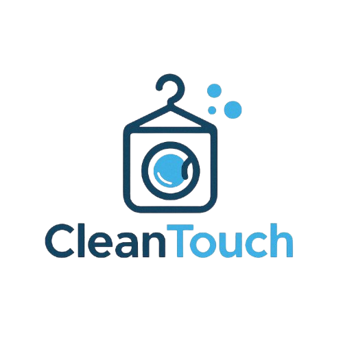

  

<h1 align="center">CleanTouch – Laundry Service Website</h1>

Responsive Front-End Web Application

---

## Overview

CleanTouch is a responsive front-end website developed for a laundry service company. The website provides customers with an easy and modern interface to explore services, learn about the company, and contact the business.

The project focuses on creating a clean user experience through responsive web design and intuitive navigation.

This project was developed as part of the Web Technologies course at King Saud University.

---

## Features

- Responsive Website Design
- Home Page
- About Us Section
- Laundry Services
- Pricing Information
- Contact Page
- Navigation Menu
- Modern User Interface
- Mobile-Friendly Layout

---

## Live Demo

🌐 **Website**

https://najla-alhusaini.github.io/cleant/

---

## Technologies Used

- HTML5
- CSS3
- JavaScript

---

## Project Resources

### Source Code

📦 [CleanTouch.zip](CleanTouch.zip)

---

### Project Report

📄 [CleanTouch Report.docx](CleanTouch%20Report.docx)

---

## Project Structure

- Home Page
- About Us
- Services
- Pricing
- Contact
- Responsive Navigation

---

## Learning Outcomes

Through this project, I practiced:

- Responsive Web Design
- HTML Structure
- CSS Styling
- JavaScript Interactivity
- Website Navigation Design
- User Interface Design
- Front-End Development

---

## Course Information

**Course:** IT312 – Web Technologies

**Institution:** King Saud University
